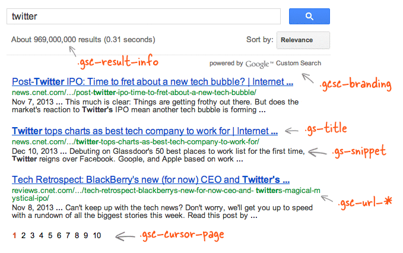

Google Custom Search một công cụ tìm kiếm của google.com cung cấp, nó đơn giản chỉ là một biểu mẫu tìm kiếm trên trang web của bạn và các kết quả được tìm thấy sẽ được hiển thị tương tự như trên google. Bạn chỉ cần vào [Google Custom Search](https://cse.google.com/cse) tạo một công cụ tìm kiếm tùy chỉnh và thêm một đoạn mã Javscript mà nó cung cấp vào trong trang web của bạn.


Nếu bạn đã từng sử dụng chức năng tìm kiếm trên trang của tôi, thì bạn có thể thấy rằng các kết quả tìm kiếm sẽ được hiển thị với một kiểu mà tôi tùy chỉnh ví dụ như các từ khóa phù hợp không được in đậm, không có địa chỉ URL dưới tiêu đề của kết quả tìm kiếm và những con số phân trang của kết quả tìm kiếm được hiển thị với những nút vuông,...

Như chú thích trong hình trên, mọi phần tử trong trang kết quả tìm kiếm có một class liên kết với nó ví dụ như nếu bạn muốn ẩn bộ đếm của kết quả tìm kiếm thì bạn có thể thêm thuộc tính `.gsc-result-info { display:none; }` Mặt định thì Google Custom Search sẽ không cho bạn thay đổi kích thước font chữ tiêu đề và kết quả tìm kiếm nhưng với CSS bạn có thể làm điều đó một cách dễ dàng.

Dưới đây là một số quy ước mà tôi sử dụng để hiển thị kết quả tìm kiếm trên trang của tôi, bạn cũng có thể tùy chỉnh thêm theo phong cách riêng của mình.
####Mã lệnh CSS
<div class="filename">style.css</div>

```css
    /* Sử dụng một font khác cho kết quả tìm kiếm */
    .gs-title, .gs-snippet {
        font-family: courier;
    }
    
    /* Thêm 1 border giữa các kết quả tìm kiếm */
    .gs-webResult {
        border: 1px solid #eee;
        padding: 1em;
    }
    
    /* Không hiển thị thông tin số lượng kết quả tìm kiếm */    
    .gsc-result-info {
        display: none;
    }
    
    /* Ẩn power by Google Custom Search */
    .gcsc-branding {
        display: none; 
    }
    
    /* Ẩn ảnh thumbnail trong kết quả tìm kiếm */
    .gsc-thumbnail {
        display: none;
    }
    
    /* Ẩn snippet trong kết quả tìm kiếm */
    .gs-snippet { 
        display: none;
    }
    
    /* Thay đổi kích thước tiêu đề của kết quả tìm kiếm */
    .gs-title a { 
        font-size: 16px;  
    }
    
    /* Thay đôi font size của snippet */
    .gs-snippet {
        font-size: 14px;
    }
    
    /* Bật/Tắt chữ đậm của từ khóa tìm kiếm */
    .gs-title b, .gs-snippet b {
        font-weight: normal;
    }
    
    /* Không hiển thị URL của trang web trong kết quả tìm kiếm */
    .gsc-url-top, .gsc-url-bottom {
        display: none;
    }
    
    /* Tùy chỉnh các nút phân trang của kết quả tìm kiếm */
    .gsc-cursor-page {
        font-size: 1.5em;
        padding: 4px 8px;
        border: 2px solid #ccc;
    }
